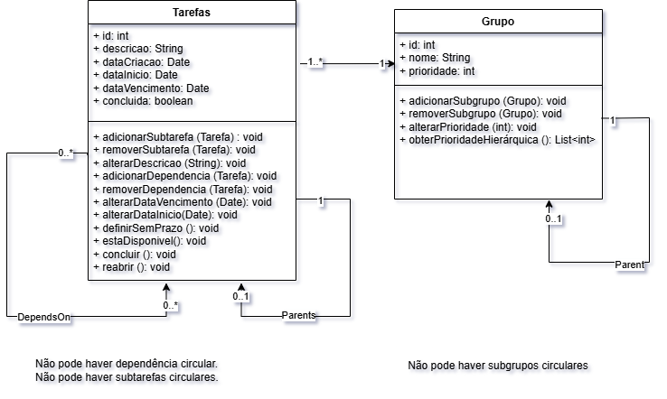

# 📋 App de Tarefas — JavaFX

Aplicação desktop para gerenciamento de tarefas pessoais, desenvolvida em **Java**, com foco em **boas práticas de engenharia de software**, **modelagem de domínio**, **testes** e **persistência em banco de dados relacional**.

Este projeto foi desenvolvido com fins de **aprendizado e portfólio**, aplicando conceitos utilizados em sistemas reais.

---

## 🎯 Objetivo do Projeto

Criar um sistema de tarefas que permita:

- Organização por **grupos e subgrupos**
- Definição de **prioridades hierárquicas**
- Controle de **dependências entre tarefas**
- Gerenciamento de **datas de início e vencimento**
- Persistência de dados em **banco de dados SQL**
- Separação clara entre **domínio**, **infraestrutura** e **interface**

---

## 🛠️ Tecnologias Utilizadas

- **Java 21**
- **JavaFX** (Interface gráfica)
- **Maven** (Gerenciamento de dependências)
- **JDBC** (Acesso direto ao banco de dados)
- **SQL** (Banco de dados relacional)
- **JUnit** (Testes unitários)
- **UML** (Modelagem do sistema)
- **Git & GitHub** (Versionamento)

---

## 🧩 Funcionalidades

- Criar, editar e remover tarefas
- Definir datas de início e vencimento
- Agrupar tarefas em grupos e subgrupos
- Priorizar tarefas com base em:
    - Hierarquia de grupos
    - Profundidade da ramificação
- Atualização controlada de dados (regras de domínio)
- Listagem e filtragem de tarefas
- Persistência completa em banco de dados

---

## 🧠 Modelagem e Arquitetura

### 📐 Diagrama de Classes (UML)

Antes da implementação, o sistema foi modelado utilizando **UML**, com foco na definição clara das regras de domínio e dos relacionamentos entre as entidades principais.

> O diagrama foi desenvolvido no draw.io e está disponível em formato editável na pasta `diagramas/`.

---

### 🧱 Arquitetura

O projeto segue uma separação lógica em camadas:

- **Domínio**  
  Contém as regras de negócio, entidades e validações do sistema.

- **Infraestrutura**  
  Responsável pela persistência dos dados, utilizando JDBC e SQL.

- **Interface (JavaFX)**  
  Camada de apresentação responsável pela interação com o usuário.

Essa separação visa facilitar a manutenção, testes e evolução do sistema.

---

## 🧪 Testes

O sistema será testado utilizando **JUnit**, com foco em:

- Regras de domínio
- Validações de estados das tarefas
- Atualizações controladas de dados

---
## 📜 Regras de Negócio

### RN-01 — Disponibilidade da Tarefa
**Descrição:**  
- Uma tarefa só pode ser considerada disponível para execução a partir da sua data de início.

**Restrições:**
- A data de início não pode ser posterior à data de vencimento.
- A tarefa pode ser editada mesmo quando ainda não estiver disponível.

**Exemplo:**
- Uma tarefa criada hoje com data de início para daqui a dois dias não deve aparecer como disponível até essa data.

### RN-02 — Hierarquia de Grupos
**Descrição:**  
- As tarefas pertencem a um grupo, que pode possuir subgrupos formando uma hierarquia.

**Restrições:**
- Um grupo pode possuir apenas um grupo pai.
- Um grupo raiz não possui grupo pai.

**Exemplo:**
- Grupo "Faculdade" → Subgrupo "Programação" → Subgrupo "Java".

### RN-03 — Prioridade Hierárquica
**Descrição:**  
- A prioridade de uma tarefa é determinada pela hierarquia de prioridades dos grupos aos quais ela pertence.

**Restrições:**
- A comparação é feita nível a nível na hierarquia.
- Em caso de empate, a tarefa pertencente à ramificação mais curta possui maior prioridade.

**Exemplo:**
- Uma tarefa em "Faculdade > Programação" tem prioridade sobre uma tarefa em "Concurso > Português > Pronomes".

### RN-04 — Dependência entre Tarefas
**Descrição:**  
- Uma tarefa pode depender da conclusão de outra tarefa para se tornar disponível.

**Restrições:**
- Uma tarefa dependente não pode ser marcada como concluída antes de suas dependências.
- Dependências cíclicas não são permitidas.

**Exemplo:**
- A tarefa "Estudar JavaFX" só fica disponível após a conclusão de "Revisar Java".

### RN-05 — Atualização Controlada
**Descrição:**  
- Certos atributos da tarefa podem ser atualizados mesmo quando a tarefa não está disponível.

**Restrições:**
- É permitido editar descrição, datas e grupo.
- Não é permitido marcar como concluída uma tarefa indisponível.

**Exemplo:**
- Alterar a data de vencimento de uma tarefa futura é permitido.

### RN-06 — Hierarquia de Tarefas
**Descrição:**  
- Uma tarefa pode possuir subtarefas, formando uma hierarquia. As subtarefas herdam, por padrão, o grupo e o contexto da tarefa pai.

**Restrições:**
- Uma tarefa pode possuir zero ou mais subtarefas.
- As subtarefas herdam inicialmente o grupo e as dependências da tarefa pai.
- A data de vencimento e o grupo das subtarefas podem ser ajustados individualmente.
- Uma tarefa pai só pode ser considerada concluída quando todas as suas subtarefas estiverem concluídas.

**Exemplo:**
- Uma tarefa "Preparar Trabalho" possui subtarefas "Pesquisar", "Escrever" e "Revisar".
- As subtarefas herdam o grupo "Faculdade".
- A tarefa pai só pode ser concluída após todas as subtarefas serem concluídas.

### RN-07 — Atualização da Data de Vencimento
**Descrição:**  
- Uma tarefa pode ter sua data de vencimento alterada a qualquer momento, desde que respeite as regras temporais do sistema.

**Restrições:**
- A nova data de vencimento deve ser igual ou posterior à data de início da própria tarefa.
- Caso a tarefa seja uma subtarefa, sua data de vencimento deve ser igual ou anterior à data de vencimento da tarefa pai.

**Exemplo:**
- Uma subtarefa com data de início em 10/05 pode ter sua data de vencimento alterada para 15/05, desde que a tarefa pai vença em 15/05 ou depois.

### RN-08 — Atualização da Data de início
**Descrição:**
- Uma tarefa pode ter a sua data de início alterada a qualquer momento, desde que respeite as regras temporais do sistema.

**Restrições:**
- A nova data de início deve ser igual ou posterior à data de início da tarefa pai.
- A nova data de início deve ser igual ou anterior a sua data de vencimento.

**Exemplo:**
- Uma subtarefa com data de vencimento 20/05 pode ter a sua data de início alterada para 05/05, desde que a tarefa pai inicie 05/05, ou antes.

### RN-09 — Retirada da Data de Vencimento
**Descrição:**  
Uma tarefa pode ter a sua data de vencimento removida, tornando-se sem prazo definido, desde que não viole as regras de hierarquia temporal.

**Restrições:**
- Caso a tarefa seja uma subtarefa, a data de vencimento só poderá ser removida se a tarefa pai não possuir data de vencimento definida.

**Exemplo:**
- Uma tarefa inicialmente com data de vencimento em 19/02 pode ter seu prazo removido e passar a ser executada a qualquer momento.
- Uma subtarefa não pode remover a sua data de vencimento se a tarefa pai possuir um prazo definido.

---

## 📌 Status do Projeto

🚧 Em desenvolvimento — fase de definição de regras de negócio e arquitetura.
